# 🛡️ SafeSafar 

<div align="center">

[](https://github.com/mnvsgn/SafeSafar/stargazers)
[](https://github.com/mnvsgn/SafeSafar/network/members)
[](https://github.com/mnvsgn/SafeSafar/issues)
[](https://github.com/mnvsgn/SafeSafar/pulls)
[](https://github.com/mnvsgn/SafeSafar/commits)
[](https://github.com/mnvsgn/SafeSafar/blob/main/LICENSE)

**A smart tourist safety and security platform for Smart India Hackathon 2025**

---

### 🛠️ **Tech Stack**


</div>

---

## 📋 Table of Contents

- [🚀 About](#-about)
- [✨ Features](#-features)
- [🏗️ Architecture](#️-architecture)
- [📦 Installation](#-installation)
- [🛠️ Usage](#️-usage)
- [📂 Project Structure](#-project-structure)
- [🤝 Contributing](#-contributing)

---

## 🚀 About

> **SafeSafar** is a comprehensive tourist safety platform designed for **Smart India Hackathon 2025 (Problem Statement 25002)**

### 🎯 **Mission**
Enable tourists to travel with confidence across India through cutting-edge technology and real-time safety solutions.

### 🔑 **Core Technologies**
- 🔗 **Blockchain-secured digital IDs**
- 📍 **Real-time geo-fencing alerts**
- 🤖 **AI-powered anomaly detection**
- 🚨 **Emergency response system**
- 🌐 **Multilingual accessibility**

---

## ✨ Features

<table>
<tr>
<td width="50%">

### 🔐 **Security & Identity**
- **Digital Tourist ID** — KYC-based blockchain onboarding
- **Data Privacy Engine** — End-to-end encryption
- **GDPR Compliance** — Secure data handling

</td>
<td width="50%">

### 📱 **User Experience**
- **Tourist Dashboard** — Safety scores & itinerary
- **Multilingual Support** — 10+ Indian languages
- **Voice Accessibility** — Audio navigation

</td>
</tr>
<tr>
<td width="50%">

### 🌍 **Location Services**
- **Geo-Fencing Alerts** — Unsafe zone warnings
- **Live Location Tracking** — Real-time positioning
- **Route Optimization** — Safe travel suggestions

</td>
<td width="50%">

### 🚨 **Emergency Response**
- **Panic Button** — Instant SOS alerts
- **Live Location Sharing** — Emergency coordination
- **Automated e-FIRs** — Quick incident reporting

</td>
</tr>
</table>

### 🤖 **AI/ML Capabilities**
- **Anomaly Detection** — Unusual pattern recognition
- **Risk Assessment** — Predictive safety scoring
- **Behavior Analysis** — Travel pattern insights

### 👮 **Law Enforcement Tools**
- **Interactive Heatmaps** — Crime pattern visualization
- **Real-time Dashboards** — Incident monitoring
- **Automated Reporting** — Streamlined documentation

---

## 🏗️ Architecture

```mermaid
graph TB
   %% Client Layer
   subgraph "🎯 Client Applications"
      subgraph "📱 Mobile Applications"
         MA[Tourist Mobile App<br/>📲 React Native<br/>🍎 iOS & 🤖 Android]
         LEA[Law Enforcement App<br/>🚔 React Native<br/>👮 Field Officers]
      end
      
      subgraph "💻 Web Applications"
         TD[Tourist Dashboard<br/>🌐 React.js + Next.js<br/>🗺️ Trip Planning & Safety]
         AD[Admin Portal<br/>⚙️ React.js<br/>🔧 System Management]
         LED[LE Command Center<br/>🖥️ React.js<br/>📊 Real-time Monitoring]
      end
      
      subgraph "🔗 Third-party Integrations"
         HA[Hotel APIs<br/>🏨 Booking Integration]
         TA[Transport APIs<br/>🚌 Bus/Train/Flight]
         GA[Govt. Portals<br/>🏛️ Official Integration]
      end
   end

   %% API Gateway Layer
   subgraph "🌐 API Gateway & Load Balancing"
      subgraph "🚪 Gateway Services"
         AG[Kong API Gateway<br/>🔒 Authentication<br/>📊 Rate Limiting<br/>🔄 Load Balancing]
         LB[Nginx Load Balancer<br/>⚖️ Traffic Distribution<br/>🛡️ SSL Termination]
      end
      
      subgraph "🛡️ Security Layer"
         WAF[Web Application Firewall<br/>🛡️ Attack Prevention<br/>🔍 Traffic Analysis]
         OAUTH[OAuth2 Service<br/>🔑 Token Management<br/>🔐 JWT Validation]
      end
   end

   %% Core Microservices
   subgraph "⚙️ Core Microservices Architecture"
      subgraph "🔐 Authentication & Identity"
         AS[Auth Service<br/>🔑 JWT/OAuth2<br/>👤 User Management<br/>🔒 MFA Support]
         DIS[Digital ID Service<br/>🆔 KYC Verification<br/>⛓️ Blockchain Identity<br/>📄 Document Validation]
         RBS[Role-Based Service<br/>👮 Permissions<br/>🎭 User Roles]
      end
      
      subgraph "🗺️ Location & Safety"
         GS[Geo-fencing Service<br/>📍 GPS Tracking<br/>⚠️ Zone Alerts<br/>🗺️ Route Planning]
         LSS[Location Safety Service<br/>📊 Risk Assessment<br/>🎯 Safety Scoring<br/>📈 Trend Analysis]
         RSS[Real-time Sync Service<br/>⚡ Live Updates<br/>🔄 Data Sync<br/>📡 WebSocket]
      end
      
      subgraph "🚨 Emergency Management"
         ES[Emergency Service<br/>🆘 Panic Button<br/>📞 Auto-Dialing<br/>📍 Location Share]
         IRS[Incident Response<br/>🚔 Police Dispatch<br/>🏥 Medical Alert<br/>📋 Case Management]
         CNS[Contact & Notification<br/>👨‍👩‍👧‍👦 Emergency Contacts<br/>📨 Multi-channel Alerts]
      end
      
      subgraph "🤖 AI/ML Intelligence"
         ADS[Anomaly Detection<br/>🧠 Pattern Recognition<br/>⚠️ Risk Prediction<br/>📊 Behavioral Analysis]
         PAS[Predictive Analytics<br/>🔮 Threat Forecasting<br/>📈 Safety Trends<br/>🎯 Risk Modeling]
         NLP[Natural Language Processing<br/>💬 Chat Support<br/>🗣️ Voice Commands<br/>📝 Text Analysis]
      end
      
      subgraph "🌍 Communication & Support"
         MS[Multilingual Service<br/>🗣️ 15+ Languages<br/>🔊 Text-to-Speech<br/>👂 Speech-to-Text]
         CS[Chat Support Service<br/>💬 24/7 Help Desk<br/>🤖 AI Chatbot<br/>👤 Human Agents]
         NS[Notification Service<br/>📱 Push Notifications<br/>📧 Email Alerts<br/>💬 SMS Gateway]
      end
   end

   %% Data & Storage Layer
   subgraph "💾 Data & Storage Infrastructure"
      subgraph "⛓️ Blockchain Network"
         BC[Hyperledger Fabric<br/>🔗 Identity Records<br/>📝 Immutable Logs<br/>🔐 Smart Contracts]
         IPFS[IPFS Network<br/>📄 Document Storage<br/>🖼️ Media Files<br/>🔒 Encrypted Storage]
      end
      
      subgraph "🗄️ Primary Databases"
         MDB[(MongoDB Cluster<br/>👤 User Profiles<br/>📍 Location Data<br/>🚨 Incidents)]
         PDB[(PostgreSQL<br/>📊 Analytics<br/>📈 Reports<br/>🔍 Complex Queries)]
      end
      
      subgraph "⚡ Cache & Performance"
         RDS[(Redis Cluster<br/>🔄 Session Storage<br/>⚡ Real-time Cache<br/>🚀 Performance)]
         CDN[CloudFlare CDN<br/>🌍 Global Distribution<br/>📦 Asset Caching<br/>⚡ Edge Computing]
      end
      
      subgraph "📊 Analytics & Search"
         ES_DB[(Elasticsearch<br/>🔍 Full-text Search<br/>📊 Log Analytics<br/>📈 Performance Metrics)]
         TS[(InfluxDB<br/>⏱️ Time Series Data<br/>📊 IoT Metrics<br/>📈 Real-time Analytics)]
      end
   end

   %% External Services
   subgraph "🔗 External Services & APIs"
      subgraph "🗺️ Maps & Location"
         GM[Google Maps API<br/>🗺️ Mapping Service<br/>🛣️ Route Optimization<br/>📍 Geocoding]
         OSM[OpenStreetMap<br/>🆓 Open Source Maps<br/>🌍 Global Coverage]
      end
      
      subgraph "🌤️ Environmental Data"
         WA[Weather APIs<br/>🌤️ Weather Conditions<br/>⚠️ Severe Weather Alerts<br/>🌡️ Temperature Data]
         AQI[Air Quality Index<br/>🌫️ Pollution Data<br/>😷 Health Advisories]
      end
      
      subgraph "📞 Communication Channels"
         SMS[SMS Gateway<br/>📱 Twilio/AWS SNS<br/>🚨 Emergency Messages<br/>🔔 OTP Service]
         PUSH[Push Notification<br/>📲 Firebase/APNs<br/>⚡ Real-time Alerts<br/>📢 Broadcasts]
         EMAIL[Email Service<br/>📧 SendGrid/SES<br/>📋 Reports & Updates<br/>📄 Documentation]
      end
      
      subgraph "🏛️ Government Integration"
         AADHAAR[Aadhaar API<br/>🆔 Identity Verification<br/>🏛️ Government Database]
         POLICE[Police Database<br/>🚔 Crime Records<br/>📊 Safety Statistics]
         TOURISM[Tourism Board API<br/>🏛️ Official Data<br/>ℹ️ Tourist Information]
      end
      
      subgraph "💳 Payment & Services"
         PAYMENT[Payment Gateway<br/>💳 Razorpay/Stripe<br/>💰 Emergency Services<br/>🎫 Bookings]
         TRANSPORT[Transport APIs<br/>🚌 IRCTC/RedBus<br/>✈️ Flight APIs<br/>🚗 Cab Services]
      end
   end

   %% Monitoring & DevOps
   subgraph "📊 Monitoring & DevOps"
      subgraph "🔍 Observability"
         PROM[Prometheus<br/>📊 Metrics Collection<br/>⚠️ Alerting Rules<br/>📈 Performance]
         GRAF[Grafana<br/>📊 Dashboards<br/>📈 Visualization<br/>🚨 Alert Management]
         JAEGER[Jaeger<br/>🔍 Distributed Tracing<br/>🐛 Error Tracking<br/>📊 Performance Analysis]
      end
      
      subgraph "📝 Logging & Security"
         ELK[ELK Stack<br/>📝 Centralized Logging<br/>🔍 Log Analysis<br/>🚨 Security Events]
         SIEM[Security Information<br/>🛡️ Threat Detection<br/>🔍 Security Analytics<br/>📊 Compliance]
      end
   end

   %% Enhanced Connections with better flow
   %% Client to Gateway
   MA -->|HTTPS/WSS| LB
   LEA -->|HTTPS/WSS| LB
   TD -->|HTTPS| LB
   AD -->|HTTPS| LB
   LED -->|HTTPS/WSS| LB
   
   HA -->|REST API| AG
   TA -->|REST API| AG
   GA -->|REST API| AG

   %% Gateway Layer Flow
   LB --> WAF
   WAF --> AG
   AG --> OAUTH

   %% Gateway to Core Services
   AG ==> AS
   AG ==> DIS
   AG ==> GS
   AG ==> ES
   AG ==> ADS
   AG ==> MS
   AG ==> NS
   AG ==> CS

   %% Inter-service Communication with cleaner paths
   AS <-.-> RBS
   AS <-.-> DIS
   GS <-.-> LSS
   GS <-.-> RSS
   ES <-.-> IRS
   ES <-.-> CNS
   ADS <-.-> PAS
   ADS <-.-> NLP
   MS <-.-> CS

   %% Services to Data Layer - organized by service type
   AS --> MDB
   RBS --> MDB
   DIS --> BC
   DIS --> IPFS
   DIS --> MDB
   
   GS --> RDS
   LSS --> PDB
   RSS --> RDS
   
   ES --> MDB
   IRS --> PDB
   CNS --> MDB
   
   ADS --> ES_DB
   PAS --> ES_DB
   NLP --> ES_DB
   ADS --> TS
   
   MS --> RDS
   CS --> MDB
   NS --> RDS

   %% External API Connections - grouped by functionality
   GS -.->|Maps API| GM
   GS -.->|Maps API| OSM
   GS -.->|Transport API| TRANSPORT
   GS -.->|Tourism API| TOURISM
   
   LSS -.->|Weather API| WA
   LSS -.->|AQI API| AQI
   LSS -.->|Police API| POLICE
   
   DIS -.->|Verification API| AADHAAR
   
   NS -.->|SMS API| SMS
   NS -.->|Push API| PUSH
   NS -.->|Email API| EMAIL
   
   ES -.->|Payment API| PAYMENT

   %% Monitoring Connections - streamlined
   AG -.->|Metrics| PROM
   AS -.->|Metrics| PROM
   ES -.->|Metrics| PROM
   GS -.->|Metrics| PROM
   ADS -.->|Metrics| PROM
   PROM --> GRAF
   
   AG -.->|Logs| ELK
   AS -.->|Logs| ELK
   ES -.->|Logs| ELK
   DIS -.->|Logs| ELK
   
   AG -.->|Traces| JAEGER
   AS -.->|Traces| JAEGER
   GS -.->|Traces| JAEGER

   %% CDN connections
   CDN -.->|Static Assets| TD
   CDN -.->|Static Assets| AD
   CDN -.->|Static Assets| LED

   %% Enhanced Styling with better visual hierarchy
   classDef clientApp fill:#e3f2fd,stroke:#1976d2,stroke-width:3px,color:#000
   classDef gateway fill:#f3e5f5,stroke:#7b1fa2,stroke-width:3px,color:#000
   classDef authService fill:#e8f5e8,stroke:#2e7d32,stroke-width:2px,color:#000
   classDef locationService fill:#fff8e1,stroke:#f57c00,stroke-width:2px,color:#000
   classDef emergencyService fill:#ffebee,stroke:#d32f2f,stroke-width:2px,color:#000
   classDef aiService fill:#f3e5f5,stroke:#512da8,stroke-width:2px,color:#000
   classDef commService fill:#e0f2f1,stroke:#00695c,stroke-width:2px,color:#000
   classDef database fill:#fff3e0,stroke:#ef6c00,stroke-width:2px,color:#000
   classDef external fill:#fce4ec,stroke:#c2185b,stroke-width:2px,color:#000
   classDef blockchain fill:#e0f2f1,stroke:#00695c,stroke-width:3px,color:#000
   classDef monitoring fill:#f1f8e9,stroke:#558b2f,stroke-width:2px,color:#000

   class MA,LEA,TD,AD,LED clientApp
   class LB,WAF,AG,OAUTH gateway
   class AS,DIS,RBS authService
   class GS,LSS,RSS locationService
   class ES,IRS,CNS emergencyService
   class ADS,PAS,NLP aiService
   class MS,CS,NS commService
   class MDB,PDB,RDS,ES_DB,TS database
   class GM,OSM,WA,AQI,SMS,PUSH,EMAIL,AADHAAR,POLICE,TOURISM,PAYMENT,TRANSPORT,HA,TA,GA external
   class BC,IPFS blockchain
   class PROM,GRAF,JAEGER,ELK,SIEM,CDN monitoring
```



---

## 📦 Installation

### **Prerequisites**
- Node.js (v16+)
- MongoDB
- Redis
- Docker (optional)

### **Quick Start**

```bash
# Clone the repository
git clone https://github.com/mnvsgn/SafeSafar.git
cd SafeSafar

# Install dependencies
npm install

# Set up environment variables
cp .env.example .env

# Start the development environment
npm run dev
```

### **Docker Setup**

```bash
# Build and run with Docker Compose
docker-compose up --build
```

---

## 🛠️ Usage

### **Development Commands**

```bash
# Start development server
npm start

# Run tests
npm test

# Build for production
npm run build

# Lint code
npm run lint

# Format code
npm run format
```

### **Environment Configuration**

| Variable | Description | Required |
|----------|-------------|----------|
| `PORT` | Server port | ✅ |
| `MONGODB_URI` | Database connection | ✅ |
| `REDIS_URL` | Cache connection | ✅ |
| `JWT_SECRET` | Authentication key | ✅ |
| `BLOCKCHAIN_RPC` | Blockchain endpoint | ✅ |

---

## 📂 Project Structure

```
SafeSafar/
├── 📱 frontend/
│   ├── mobile/              # React Native app
│   │   ├── src/
│   │   ├── components/
│   │   └── screens/
│   └── web/                 # Web portal & dashboard
│       ├── src/
│       └── public/
│
├── ⚡ backend/
│   ├── auth-service/        # Authentication & authorization
│   ├── digital-id-service/  # Blockchain identity management
│   ├── geofencing-service/  # Location-based services
│   ├── emergency-service/   # SOS & incident handling
│   ├── anomaly-ml-service/  # AI/ML analytics
│   └── multilingual-service/ # Language processing
│
├── ⛓️ blockchain/           # Smart contracts
│   ├── contracts/
│   └── migrations/
│
├── 🤖 ai-ml/               # Machine learning models
│   ├── models/
│   ├── datasets/
│   └── pipelines/
│
├── 🐳 infra/               # Infrastructure
│   ├── docker/
│   ├── kubernetes/
│   └── ci-cd/
│
├── 📚 docs/                # Documentation
│   ├── api/
│   ├── architecture/
│   └── user-guides/
│
└── 📄 README.md
```

---

## 🤝 Contributing

We welcome contributions from the community! Here's how you can help:

### **Getting Started**

1. **Fork** the project
2. **Clone** your fork
   ```bash
   git clone https://github.com/your-username/SafeSafar.git
   ```
3. **Create** a feature branch
   ```bash
   git checkout -b feature/amazing-feature
   ```
4. **Commit** your changes
   ```bash
   git commit -m 'Add some amazing feature'
   ```
5. **Push** to the branch
   ```bash
   git push origin feature/amazing-feature
   ```
6. **Open** a Pull Request

### **Development Guidelines**

- Follow the existing code style
- Write tests for new features
- Update documentation as needed
- Ensure all tests pass before submitting

### **Issue Reporting**

Found a bug? Have a feature request? [Open an issue](https://github.com/mnvsgn/SafeSafar/issues) and we'll address it promptly.

---

<div align="center">

### 🌏 **SafeSafar — Safe. Smart. Safar.** ✈️

**Made with ❤️ by the SafeSafar Team**

---

**© 2025 SafeSafar Team. All rights reserved.**

</div>